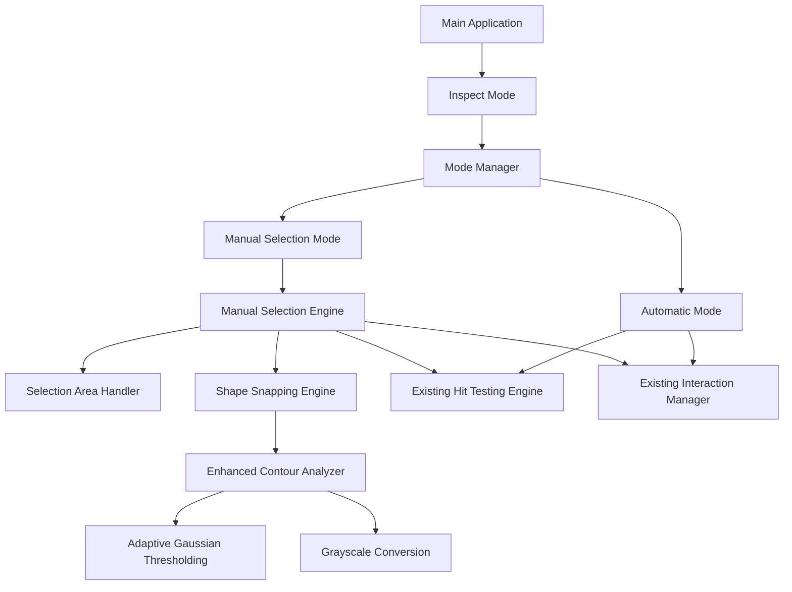

# Design Document

## Overview

This design extends the existing A4 object dimension scanner with manual shape selection capabilities and enhanced contour analysis. The system will integrate seamlessly with the current interactive inspect mode, adding new interaction modes that allow users to manually select and snap to shapes within drawn selection areas.

The design leverages the existing architecture components (InteractionManager, HitTestingEngine, SelectiveRenderer) while adding new modules for manual selection, enhanced image processing, and mode management.

## Architecture

### High-Level Architecture



### Integration Points

The manual selection system integrates with existing components:

1. **InteractionManager**: Extended to handle mode switching and manual selection events
2. **HitTestingEngine**: Enhanced to work with manually selected regions
3. **SelectiveRenderer**: Extended to render selection rectangles and mode indicators
4. **Measurement Pipeline**: Reuses existing `classify_and_measure` functions

## Components and Interfaces

### 1. ModeManager

**Purpose**: Manages switching between automatic, manual rectangle, and manual circle modes.

```python
class ModeManager:
    def __init__(self):
        self.current_mode: SelectionMode
        self.mode_indicators: Dict[SelectionMode, str]
    
    def cycle_mode(self) -> SelectionMode
    def get_current_mode(self) -> SelectionMode
    def set_mode(self, mode: SelectionMode) -> None
```

**Key Methods**:
- `cycle_mode()`: Cycles through AUTO → MANUAL_RECTANGLE → MANUAL_CIRCLE → AUTO
- `get_mode_indicator()`: Returns display text for current mode
- `is_manual_mode()`: Returns True if in any manual mode

### 2. ManualSelectionEngine

**Purpose**: Handles the core manual selection workflow including area selection and shape snapping.

```python
class ManualSelectionEngine:
    def __init__(self, enhanced_analyzer: EnhancedContourAnalyzer):
        self.analyzer = enhanced_analyzer
        self.selection_state: SelectionState
        self.snap_engine: ShapeSnappingEngine
    
    def start_selection(self, x: int, y: int) -> None
    def update_selection(self, x: int, y: int) -> None
    def complete_selection(self, mode: SelectionMode) -> Optional[Dict]
    def cancel_selection(self) -> None
```

**Key Features**:
- Tracks mouse drag operations for selection rectangle
- Coordinates with ShapeSnappingEngine for shape detection
- Integrates with existing measurement pipeline

### 3. ShapeSnappingEngine

**Purpose**: Analyzes selected regions and snaps to the most prominent circle or rectangle.

```python
class ShapeSnappingEngine:
    def __init__(self, analyzer: EnhancedContourAnalyzer):
        self.analyzer = analyzer
    
    def snap_to_shape(self, image: np.ndarray, selection_rect: Tuple, 
                     mode: SelectionMode) -> Optional[Dict]
    def find_best_circle(self, contours: List, selection_rect: Tuple) -> Optional[Dict]
    def find_best_rectangle(self, contours: List, selection_rect: Tuple) -> Optional[Dict]
```

**Algorithm**:
1. Extract region of interest from selection rectangle
2. Apply enhanced contour analysis to the region
3. Find all potential shapes (circles/rectangles) in the region
4. Score shapes based on:
   - Size (larger shapes preferred)
   - Position (centered in selection preferred)
   - Shape quality (circularity for circles, rectangularity for rectangles)
5. Return the highest-scoring shape matching the current mode

### 4. EnhancedContourAnalyzer

**Purpose**: Provides improved contour detection using Adaptive Gaussian thresholding.

```python
class EnhancedContourAnalyzer:
    def __init__(self):
        self.gaussian_block_size: int = 31
        self.gaussian_c: float = 7.0
    
    def analyze_region(self, image: np.ndarray, roi: Tuple) -> List[np.ndarray]
    def apply_adaptive_gaussian_threshold(self, gray: np.ndarray) -> np.ndarray
    def find_enhanced_contours(self, binary: np.ndarray) -> List[np.ndarray]
```

**Processing Pipeline**:
1. Convert region to grayscale
2. Apply Adaptive Gaussian thresholding
3. Perform morphological operations for noise reduction
4. Find contours using cv2.RETR_TREE for nested shapes
5. Filter contours by minimum area and validity

### 5. Extended InteractionManager

**Purpose**: Extends existing InteractionManager to handle manual selection modes.

```python
class ExtendedInteractionManager(InteractionManager):
    def __init__(self, ...):
        super().__init__(...)
        self.mode_manager = ModeManager()
        self.manual_engine = ManualSelectionEngine(...)
        self.selection_overlay = SelectionOverlay()
    
    def handle_key_press(self, key: int) -> bool
    def handle_manual_mouse_event(self, event, x, y, flags, param) -> None
    def render_with_manual_overlays(self) -> np.ndarray
```

**New Responsibilities**:
- Mode switching via keyboard input
- Manual selection mouse event handling
- Rendering selection overlays and mode indicators
- Coordinating between automatic and manual detection

## Data Models

### SelectionMode Enum

```python
from enum import Enum

class SelectionMode(Enum):
    AUTO = "auto"
    MANUAL_RECTANGLE = "manual_rect"
    MANUAL_CIRCLE = "manual_circle"
```

### SelectionState

```python
@dataclass
class SelectionState:
    is_selecting: bool = False
    start_point: Optional[Tuple[int, int]] = None
    current_point: Optional[Tuple[int, int]] = None
    selection_rect: Optional[Tuple[int, int, int, int]] = None  # x, y, w, h
```

### ManualShapeResult

```python
@dataclass
class ManualShapeResult:
    type: str  # "circle" or "rectangle"
    detection_method: str = "manual"
    confidence_score: float = 0.0
    selection_rect: Tuple[int, int, int, int]
    # Inherits all fields from existing measurement results
```

## Error Handling

### Selection Validation

1. **Empty Selection**: If no shapes found in selection area, display "No shapes detected in selection" message
2. **Invalid Selection**: If selection area too small (< 20x20 pixels), ignore selection
3. **Mode Mismatch**: If wrong shape type detected for current mode, show warning but allow selection

### Fallback Strategies

1. **Enhanced Analysis Failure**: Fall back to standard thresholding if Adaptive Gaussian fails
2. **No Manual Shapes**: Allow user to retry selection or switch back to automatic mode
3. **Performance Issues**: Disable real-time selection preview if frame rate drops below threshold

### User Feedback

- Visual indicators for all error states
- Clear instructions displayed during manual selection
- Progress indicators for processing-intensive operations

## Testing Strategy

### Unit Tests

1. **ModeManager**: Test mode cycling and state management
2. **ShapeSnappingEngine**: Test shape detection accuracy with various inputs
3. **EnhancedContourAnalyzer**: Test thresholding and contour detection
4. **Selection Geometry**: Test coordinate transformations and region extraction

### Integration Tests

1. **Manual Selection Workflow**: End-to-end testing of selection → detection → measurement
2. **Mode Switching**: Test seamless transitions between automatic and manual modes
3. **Performance**: Ensure manual selection doesn't degrade overall system performance
4. **Measurement Consistency**: Verify manual and automatic measurements produce consistent results

### Interactive Tests

1. **User Experience**: Test selection accuracy with various object types
2. **Edge Cases**: Test with overlapping shapes, partial shapes, and complex backgrounds
3. **Performance**: Test responsiveness during real-time selection feedback

## Implementation Considerations

### Performance Optimization

1. **Region-Based Processing**: Only analyze selected regions, not entire image
2. **Lazy Loading**: Initialize enhanced analyzer only when manual mode is first used
3. **Caching**: Cache processed regions to avoid recomputation during selection refinement
4. **Frame Rate Management**: Use existing FrameRateOptimizer for smooth interaction

### User Experience

1. **Visual Feedback**: Real-time selection rectangle with semi-transparent overlay
2. **Mode Indicators**: Clear display of current mode in corner of window
3. **Keyboard Shortcuts**: Intuitive key mapping (M for mode cycling, ESC for cancel)
4. **Snap Feedback**: Visual confirmation when shape is successfully detected

### Backward Compatibility

1. **Existing API**: All existing measurement functions remain unchanged
2. **Configuration**: New parameters added to config.py without breaking existing settings
3. **Data Format**: Manual measurements use same data structure as automatic ones
4. **Integration**: Manual mode is additive - automatic mode behavior unchanged